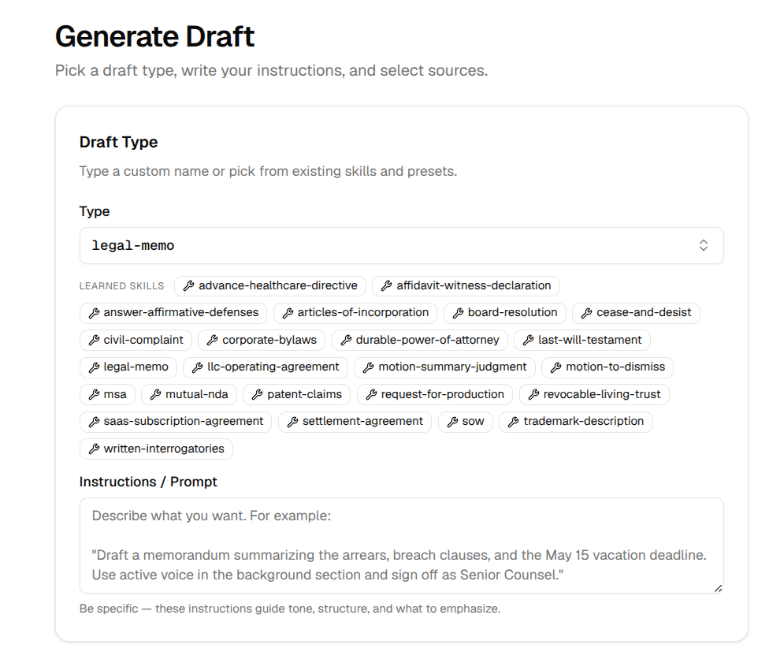
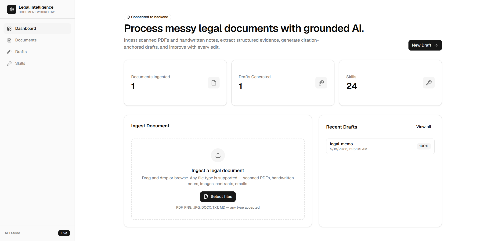
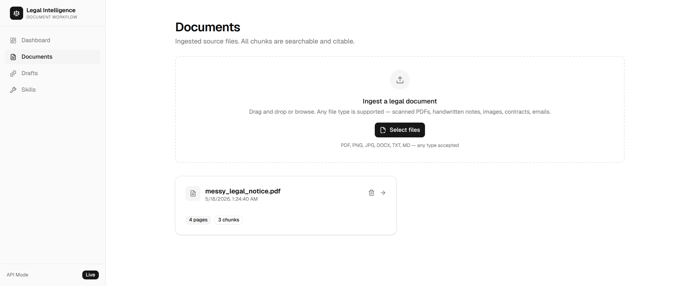
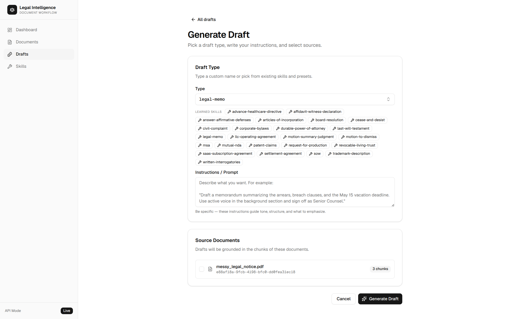
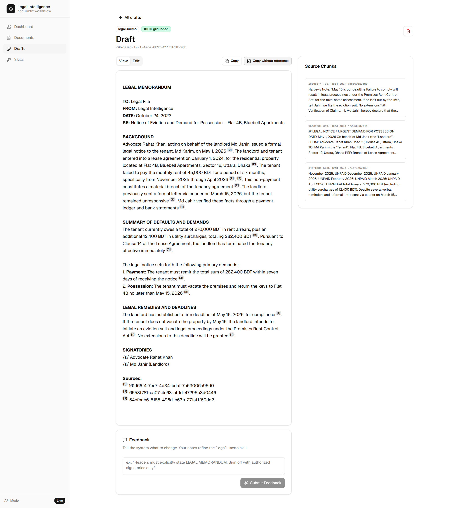
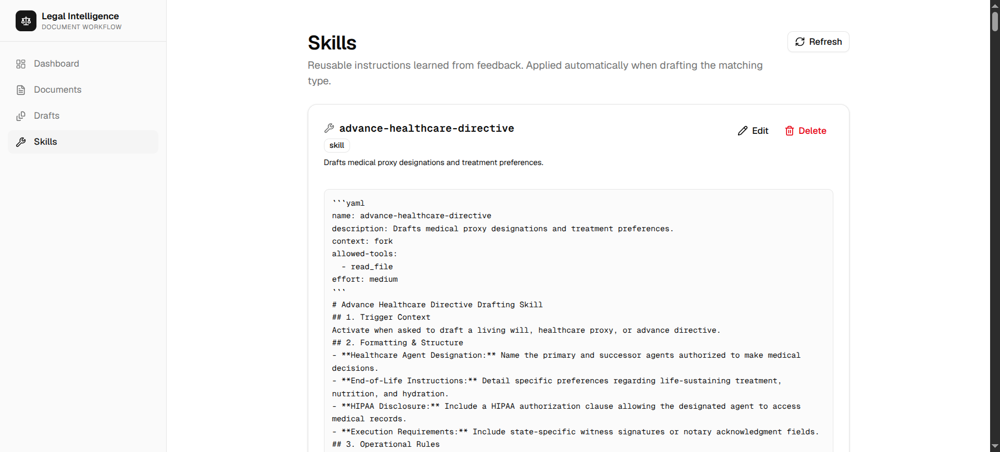

# Legal Draft Skill



[](https://pypi.org/project/legal-draft-skill/)
[](https://pypi.org/project/legal-draft-skill/)
[](LICENSE)

Legal Draft Skill is a professional-grade legal document intelligence system. It specializes in processing complex, "messy" legal documents, performing strictly grounded retrieval (RAG), and continuously improving through a type-centric learning loop that captures operator edits.

**Creating professional legal drafts from messy documents has never been easier.** With our modern web interface, you can move from raw, unorganized files to high-quality, cited drafts in seconds.

## UI Experience: Effortless Drafting

### 1. Dashboard Overview

Monitor your system's activity at a glance. Track ingested documents, generated drafts, and the overall grounding accuracy of your system.

### 2. Streamlined Document Ingestion

Simply drag and drop your messy legal documents. Whether it's a scanned PDF, a handwritten note, or a complex contract, our Docling-powered engine extracts every piece of evidence with high fidelity.

### 3. Interactive Drafting Workflow

Select your draft type and provide specific instructions. The UI allows you to pick from 24 specialized skills or create custom ones on the fly.

### 4. Grounded Evidence & Citations

Every draft is 100% grounded. The UI highlights the exact source chunks used for every claim, providing full transparency and auditability.

### 5. Persistent Skill Management

Tailor the system to your firm's standards. Manage, edit, and refine the 24 pre-loaded drafting skills directly through the interface.

## Key Features

- **High-Fidelity Ingestion:** Leverages [Docling](https://github.com/docling-project/docling) for advanced parsing with integrated OCR.
- **Strictly Grounded RAG:** Claims are anchored to specific evidence using local vector search (SQLite + `sqlite-vec`).
- **Autonomous Learning Loop:** The system learns your stylistic preferences from your edits.
- **Unified Distribution:** A single Python package serves both the Backend and the UI.

## Agent Skills
Legal Draft Skill utilizes a structured **Skills** architecture. The system comes pre-loaded with **24 specialized skills** for various legal drafting scenarios:

- `legal-memo`: Enforce memorandum headers, active voice, and specific signatory requirements.
- `civil-complaint`: Drafts formal initial pleadings to initiate a lawsuit.
- `answer-affirmative-defenses`: Drafts responsive pleadings and legal affirmative defenses.
- `motion-to-dismiss`: Drafts motions challenging a complaint's legal sufficiency.
- `motion-summary-judgment`: Drafts motions for judgment based on undisputed facts.
- `written-interrogatories`: Drafts formal written questions for discovery purposes.
- `request-for-production`: Drafts formal requests for physical or electronic evidence.
- `settlement-agreement`: Drafts binding agreements to resolve legal disputes.
- `affidavit-witness-declaration`: Drafts formal sworn statements for evidentiary use.
- `mutual-nda`: Drafts mutual agreements to protect confidential information.
- `msa`: Drafts primary frameworks for ongoing professional services.
- `sow`: Defines specific project deliverables, timelines, and pricing.
- `saas-subscription-agreement`: Drafts terms for accessing cloud-hosted software services.
- `articles-of-incorporation`: Drafts foundational corporate charter and organizational filings.
- `corporate-bylaws`: Drafts internal corporate rules and governance frameworks.
- `llc-operating-agreement`: Defines ownership, management, and LLC tax structures.
- `board-resolution`: Drafts formal authorizations and board-level decisions.
- `last-will-testament`: Drafts testamentary documents for asset distribution.
- `revocable-living-trust`: Drafts trust structures for asset management and distribution.
- `durable-power-of-attorney`: Drafts authorizations for financial and business management.
- `advance-healthcare-directive`: Drafts medical proxy designations and treatment preferences.
- `patent-claims`: Drafts utility patent claims following strict guidelines.
- `trademark-description`: Drafts identifications of mark-related goods and services.
- `cease-and-desist`: Drafts formal demands to halt unauthorized activities.

### Using Skills with other LLMs (Claude, etc.)
If you want to use these specialized legal skills in Claude or other LLM interfaces, you can find the structured `SKILL.md` files in the `src/legal_draft_skill/skills/` folder. Simply copy the content of the relevant skill's `SKILL.md` file and paste it into your system prompt or instructions.

## Quick Start

### Installation

```bash
pip install legal-draft-skill
```

### Running the System

Start the unified system with a single command:

```bash
legal-draft-skill start --provider "openrouter" --llm "google/gemini-2.0-flash-001" --api-key "your-api-key"
```

Access the platform at:
- **Web Interface:** [http://localhost:8000](http://localhost:8000)
- **API Documentation:** [http://localhost:8000/docs](http://localhost:8000/docs)

## Documentation

For detailed guides, please refer to:

- [**Technical Documentation**](DOCUMENTATION.md): Installation, API, architecture, and evaluations.
- [**Contributing Guide**](CONTRIBUTING.md): Instructions for developers.

## License

This project is licensed under the MIT license.
