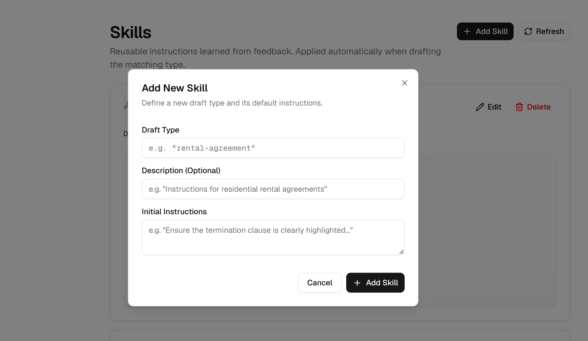

# Legal Draft Agent

## Why Legal Draft Agent?

Standard AI chatbots are completely risky for legal drafting—so I built a completely free, open-source Legal Draft Agent with a beautiful UI. Creating professional legal drafts from messy documents is always a massive challenge. It usually boils down to two main bottlenecks. First, legal documents are massive. Context overreach and poor retrieval are constant issues. Second, hallucination is a risk you simply cannot take with legal paperwork. Add in the fact that legal documents require a highly distinct style. Standard AI chatbots just won't cut it. Without the right engineering, prompting an LLM for legal work is dangerous.

That is exactly why I built Legal Draft Agent. It solves these critical issues while giving you a seamless, professional UI. You can ingest any kind of file—from short briefs to massive datasets with millions of lines. Messy formatting? Handwritten images? PDFs, OCR, Docs, or Markdown? It handles them all via a superior RAG pipeline.

Once your data is ingested, you can generate precise legal drafts backed by specialized system prompts and feedback loops. Every single output comes with references, grounding, and evaluation scores to eliminate hallucinations. It comes packed with 24 pre-loaded skills right out of the box. Even better, it includes an AI-powered auto-skill creator. If you are frustrated with an initial draft, you just give the AI feedback. That feedback automatically updates and creates new skills. You teach the AI once, and it never makes that mistake again. With this modern web interface, you can move from raw, unorganized files to high-quality, cited drafts in seconds. Getting started is incredibly easy. You can route to any LLM via OpenRouter.


[](https://pypi.org/project/legal-draft-agent/)
[](https://pypi.org/project/legal-draft-agent/)
[](LICENSE)

Legal Draft Agent is a professional-grade legal document intelligence system. It specializes in processing complex, "messy" legal documents, performing strictly grounded retrieval (RAG), and continuously improving through a type-centric learning loop that captures operator edits.

**Creating professional legal drafts from messy documents has never been easier.** With our modern web interface, you can move from raw, unorganized files to high-quality, cited drafts in seconds.

## UI Experience: Effortless Drafting

### Effortless drafting with skill

Creating legal drafts from messy documents is easier than ever with our intuitive UI. Select your draft type, provide instructions, and let the agent do the heavy lifting.

### 1. Dashboard Overview

Monitor your system's activity at a glance. Track ingested documents, generated drafts, and the overall grounding accuracy of your system.

### 2. Streamlined Document Ingestion

Simply drag and drop your messy legal documents. Whether it's a scanned PDF, a handwritten note, or a complex contract, our Docling-powered engine extracts every piece of evidence with high fidelity.

### 3. Interactive Drafting Workflow

Select your draft type and provide specific instructions. The UI allows you to pick from 24 specialized skills or create custom ones on the fly.

### 4. Grounded Evidence & Citations

Every draft is 100% grounded. The UI highlights the exact source chunks used for every claim, providing full transparency and auditability.

### 5. Persistent Skill Management

Tailor the system to your firm's standards. Manage, edit, and refine the 24 pre-loaded drafting skills directly through the interface.

### 6. Creating Skills is Easy

Need a new draft type? Creating a custom AI skill is easy. Just define the name and initial instructions, and the agent will handle the rest.

## Key Features

- **High-Fidelity Multi-Format Ingestion:** Leverages [Docling](https://github.com/docling-project/docling) for advanced parsing of multiple document formats including **PDF, DOCX, PPTX, XLSX, HTML, WAV, MP3, WebVTT, images (PNG, TIFF, JPEG, ...), LaTeX, and plain text.**
- **📑 Advanced PDF Understanding:** Deep layout analysis including **page layout, reading order, table structure, code, formulas, and image classification.**
- **Strictly Grounded RAG:** Every claim in a generated draft is anchored to specific source evidence using local vector search (SQLite + `sqlite-vec`).
- **Autonomous Learning Loop:** The system captures operator edits to extract and apply reusable drafting patterns and stylistic preferences.
- **Unified Distribution:** A single Python package that serves both the Backend and the UI.

## Use Cases

- **Litigation Preparation:** Rapidly summarize messy discovery productions and draft cited complaints or motions.
- **Contract Management:** Extract key terms from various contract formats and generate standardized legal memos or summaries.
- **Corporate Governance:** Automate the drafting of board resolutions and bylaws while maintaining strict adherence to firm standards.
- **Estate Planning:** Transform unstructured notes and asset lists into formal testamentary documents.
- **Intellectual Property:** Process technical descriptions and draft precise patent claims or trademark identifications.

## Agent Skills
Legal Draft Agent utilizes a structured **Skills** architecture. The system comes pre-loaded with **24 specialized skills** for various legal drafting scenarios:

- `legal-memo`: Enforce memorandum headers, active voice, and specific signatory requirements.
- `civil-complaint`: Drafts formal initial pleadings to initiate a lawsuit.
- `answer-affirmative-defenses`: Drafts responsive pleadings and legal affirmative defenses.
- `motion-to-dismiss`: Drafts motions challenging a complaint's legal sufficiency.
- `motion-summary-judgment`: Drafts motions for judgment based on undisputed facts.
- `written-interrogatories`: Drafts formal written questions for discovery purposes.
- `request-for-production`: Drafts formal requests for physical or electronic evidence.
- `settlement-agreement`: Drafts binding agreements to resolve legal disputes.
- `affidavit-witness-declaration`: Drafts formal sworn statements for evidentiary use.
- `mutual-nda`: Drafts mutual agreements to protect confidential information.
- `msa`: Drafts primary frameworks for ongoing professional services.
- `sow`: Defines specific project deliverables, timelines, and pricing.
- `saas-subscription-agreement`: Drafts terms for accessing cloud-hosted software services.
- `articles-of-incorporation`: Drafts foundational corporate charter and organizational filings.
- `corporate-bylaws`: Drafts internal corporate rules and governance frameworks.
- `llc-operating-agreement`: Defines ownership, management, and LLC tax structures.
- `board-resolution`: Drafts formal authorizations and board-level decisions.
- `last-will-testament`: Drafts testamentary documents for asset distribution.
- `revocable-living-trust`: Drafts trust structures for asset management and distribution.
- `durable-power-of-attorney`: Drafts authorizations for financial and business management.
- `advance-healthcare-directive`: Drafts medical proxy designations and treatment preferences.
- `patent-claims`: Drafts utility patent claims following strict guidelines.
- `trademark-description`: Drafts identifications of mark-related goods and services.
- `cease-and-desist`: Drafts formal demands to halt unauthorized activities.

### Using Skills with other LLMs (Claude, etc.)
If you want to use these specialized legal skills in Claude or other LLM interfaces, you can find the structured `SKILL.md` files in the `src/legal_draft_agent/skills/` folder. Simply copy the content of the relevant skill's `SKILL.md` file and paste it into your system prompt or instructions.

For a larger collection of pre-built drafting patterns, visit the [**Legal Draft Skills Repository**](https://github.com/fazlulkarimweb/legal-draft-skills).

## Quick Start

### Installation

```bash
pip install legal-draft-agent
```

### Running the System

Start the unified system with a single command. You will need an API key from [**OpenRouter.ai**](https://openrouter.ai/). 

**To get an API key:**
1. Create an account at [openrouter.ai](https://openrouter.ai/).
2. Navigate to **Keys** in your dashboard.
3. Click **Create Key** and copy the resulting string.

```bash
legal-draft-agent start --provider "openrouter" --llm "google/gemini-2.0-flash-001" --api-key "your-api-key"
```

Access the platform at:
- **Web Interface:** [http://localhost:8000](http://localhost:8000)
- **API Documentation:** [http://localhost:8000/docs](http://localhost:8000/docs)

## Documentation

For detailed guides, please refer to:

- [**Technical Documentation**](DOCUMENTATION.md): Installation, API, architecture, and evaluations.
- [**Contributing Guide**](CONTRIBUTING.md): Instructions for developers.

## License

This project is licensed under the MIT license.
